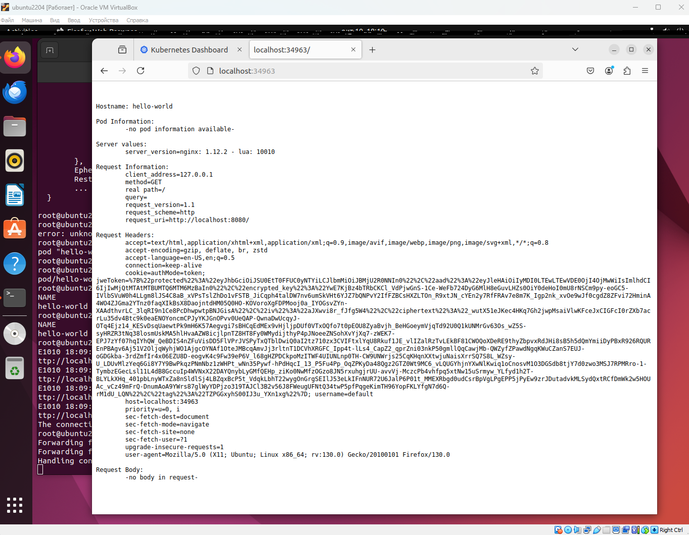
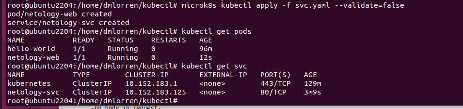
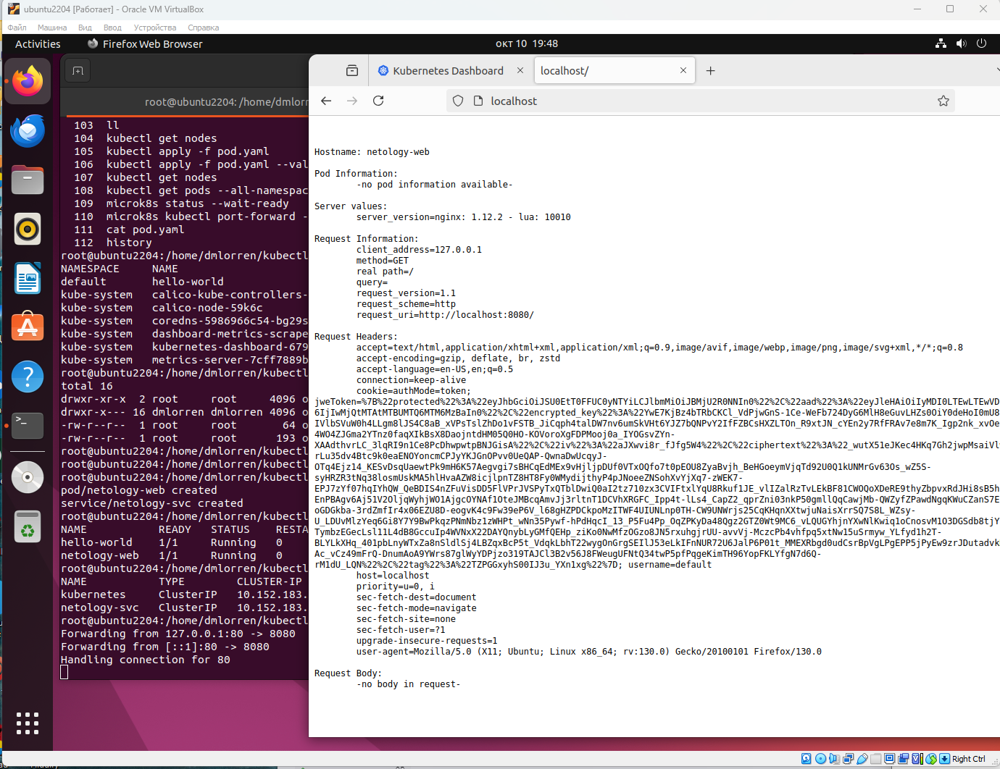

# Домашнее задание к занятию «Базовые объекты K8S» - Иванов Дмитрий (fops-13)

### Цель задания

В тестовой среде для работы с Kubernetes, установленной в предыдущем ДЗ, необходимо развернуть Pod с приложением и подключиться к нему со своего локального компьютера. 

------

### Чеклист готовности к домашнему заданию

1. Установленное k8s-решение (например, MicroK8S).
2. Установленный локальный kubectl.
3. Редактор YAML-файлов с подключенным Git-репозиторием.

------

### Инструменты и дополнительные материалы, которые пригодятся для выполнения задания

1. Описание [Pod](https://kubernetes.io/docs/concepts/workloads/pods/) и примеры манифестов.
2. Описание [Service](https://kubernetes.io/docs/concepts/services-networking/service/).

------

### Задание 1. Создать Pod с именем hello-world

1. Создать манифест (yaml-конфигурацию) Pod.
2. Использовать image - gcr.io/kubernetes-e2e-test-images/echoserver:2.2.
3. Подключиться локально к Pod с помощью `kubectl port-forward` и вывести значение (curl или в браузере).


### Ответ:
1. Задание выполняется на основании иструкции по установке кубера в ДЗ №1, базовый набор команд (но лучше всего обращаться к офф документации):
```
sudo install -o root -g root -m 0755 kubectl /usr/local/bin/kubectl
curl -LO "https://dl.k8s.io/release/$(curl -L -s https://dl.k8s.io/release/stable.txt)/bin/linux/amd64/kubectl"
echo "$(cat kubectl.sha256)  kubectl" | sha256sum --check
install -o root -g root -m 0755 kubectl /usr/local/bin/kubectl
kubectl version --client
```

2. Подготовлен под:
```
root@ubuntu2204:/home/dmlorren/kubectl# cat pod.yaml 

apiVersion: v1

kind: Pod

metadata:

  name: hello-world

spec:

  containers:

  - name: echoserver

    image: gcr.io/kubernetes-e2e-test-images/echoserver:2.2

    ports:

    - containerPort: 8080

```

Используются команды:
```
kubectl get pods --all-namespaces

microk8s status --wait-ready

microk8s kubectl apply -f pod.yaml 

microk8s kubectl port-forward -n kube-system service/kubernetes-dashboard 10443:443 --insecure-skip-tls-verify
```




------

### Задание 2. Создать Service и подключить его к Pod

1. Создать Pod с именем netology-web.
2. Использовать image — gcr.io/kubernetes-e2e-test-images/echoserver:2.2.
3. Создать Service с именем netology-svc и подключить к netology-web.
4. Подключиться локально к Service с помощью `kubectl port-forward` и вывести значение (curl или в браузере).


### Ответ:

1. Подготовлен под:
```
apiVersion: v1

kind: Pod

metadata:

  name: netology-web

  labels:

    app: netology-web

spec:

  containers:

  - name: echoserver

    image: gcr.io/kubernetes-e2e-test-images/echoserver:2.2

    ports:

    - containerPort: 8080

---

apiVersion: v1

kind: Service

metadata:

  name: netology-svc

spec:

  ports:

  - protocol: TCP

    port: 80

    targetPort: 8080

  selector:

    app: netology-web
```

2. Используется следующий набор команд:
```
microk8s kubectl apply -f svc.yaml --validate=false

kubectl get pods

kubectl get svc

kubectl port-forward svc/netology-svc 80:80
```




------

