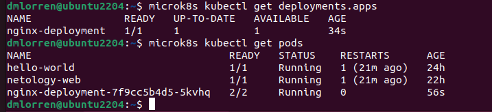
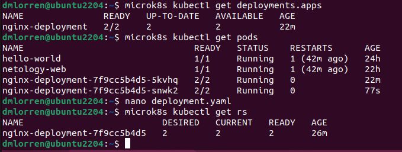
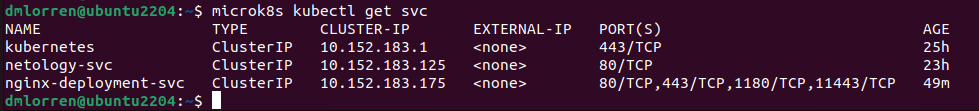
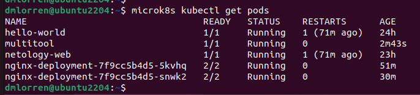
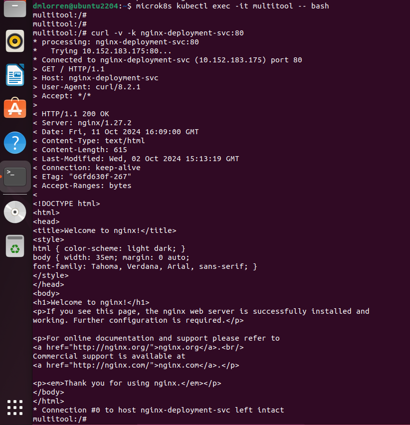
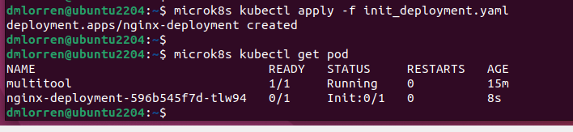
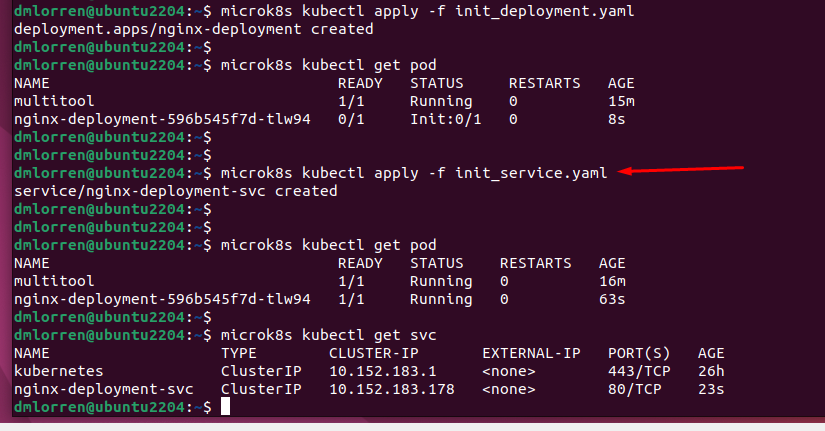

# Домашнее задание к занятию «Запуск приложений в K8S» - Иванов Дмитрий (fops-13)

### Цель задания

В тестовой среде для работы с Kubernetes, установленной в предыдущем ДЗ, необходимо развернуть Deployment с приложением, состоящим из нескольких контейнеров, и масштабировать его.

------

### Чеклист готовности к домашнему заданию

1. Установленное k8s-решение (например, MicroK8S).
2. Установленный локальный kubectl.
3. Редактор YAML-файлов с подключённым git-репозиторием.

------

### Инструменты и дополнительные материалы, которые пригодятся для выполнения задания

1. [Описание](https://kubernetes.io/docs/concepts/workloads/controllers/deployment/) Deployment и примеры манифестов.
2. [Описание](https://kubernetes.io/docs/concepts/workloads/pods/init-containers/) Init-контейнеров.
3. [Описание](https://github.com/wbitt/Network-MultiTool) Multitool.

------

### Задание 1. Создать Deployment и обеспечить доступ к репликам приложения из другого Pod

1. Создать Deployment приложения, состоящего из двух контейнеров — nginx и multitool. Решить возникшую ошибку.
2. После запуска увеличить количество реплик работающего приложения до 2.
3. Продемонстрировать количество подов до и после масштабирования.
4. Создать Service, который обеспечит доступ до реплик приложений из п.1.
5. Создать отдельный Pod с приложением multitool и убедиться с помощью `curl`, что из пода есть доступ до приложений из п.1.


### Ответ:
1. При первичном запуске сталкиваемся с проблемой пересечением nginx портов в контейнерах nginx и multitool, можно переназначить порты в описании переменных окружения или сделать ход конём, запустить контейнер mulitul c тэгом openshift (дописать в манифесте к образу), тогда, по умолчанию, будут слушаться порты 1180 и 11443 соответственно. 

выдержка из документации:
```
openshift , openshift-minimal (openshift compatible - minimal) - Ports: 1180, 11443
openshift-extra (openshift compatible with extra tools) - Ports: 1180, 11443
```
1.1 Выполняем блок команд:
```
microk8s kubectl apply -f deployment.yaml
microk8s kubectl get deployments.apps
microk8s kubectl get pods
```
1.2 Обновляем наш deployment.yaml увеличивая количесто реплик пода до 2-х и проверяем результат (так же, через apply).

количество подов ДО масштабирования:


количество подов ПОСЛЕ масштабирования:


2. Ещё раз обновляем deployment.yaml прокидываем сервис который будет обеспечивать доступ до реплик приложений (сервис можно создать и отдельным манифестом, но у меня всё в одном)

3. И сразу создаём манифест для отдельного пода с контейнером mutltitool. В нём тэг latest, а пересечение портов решено редактированием через env.
3.1 Выполняем блок команд:
```
microk8s kubectl apply -f multitool_pod.yaml
microk8s kubectl get svc
```

убеждаемся, что наш сервис запущен и работает


убеждаемся, что наш ПОД multitool запущен и работает


зайдём в искомый контейнер и выполним curl запрос
```
microk8s kubectl exec -it multitool --bash
curl -v -k nginx-deployment-svc:80
```



Конфиги:
Итоговый с 2-мя репликами и сервисом [deployment.yaml](./src/deployment.yaml)
Манифест для mutlitool [multitool_pod.yaml](./src/multitool_pod.yaml)

------

### Задание 2. Создать Deployment и обеспечить старт основного контейнера при выполнении условий

1. Создать Deployment приложения nginx и обеспечить старт контейнера только после того, как будет запущен сервис этого приложения.
2. Убедиться, что nginx не стартует. В качестве Init-контейнера взять busybox.
3. Создать и запустить Service. Убедиться, что Init запустился.
4. Продемонстрировать состояние пода до и после запуска сервиса.


### Ответ:
1. Наш ПОД из манифеста [init_deployment.yaml](./src/init_deployment.yaml) не стартует ДО запуска сервиса:


2. Подготавливаем [init_service.yaml](./src/init_service.yaml) и стартуем. Отмечу, что очень важно отслеживать в каком неймспейсе происходит деплой ресурсов, по умолчанию это default (отражено в command для init_deployment.yaml).

```
microk8s kubectl apply -f init_deployment.yaml 
microk8s kubectl apply -f init_service.yaml
microk8s kubectl get svc
microk8s kubectl get pod
```

проверяем под после запуска сервиса:


Конфиги:
[init_deployment.yaml](./src/init_deployment.yaml)
[init_service.yaml](./src/init_service.yaml)

------
