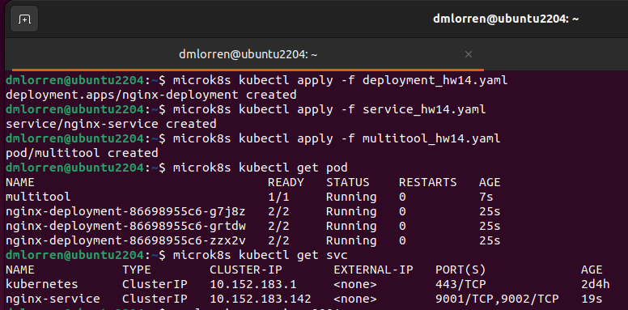
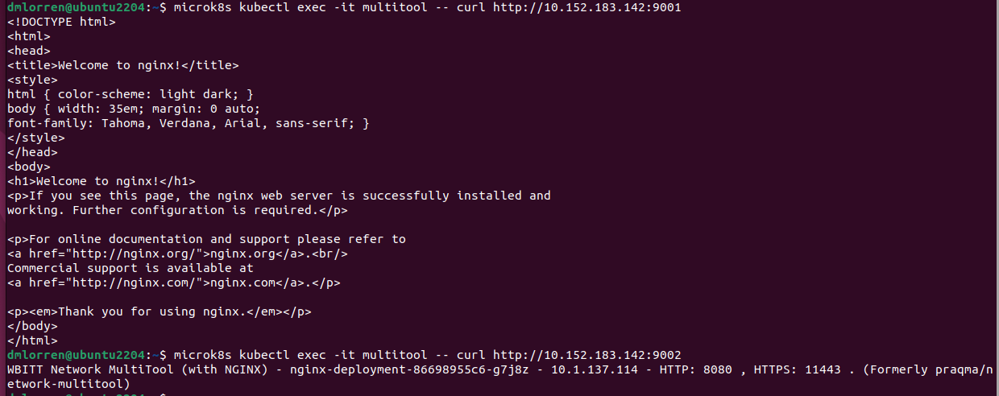
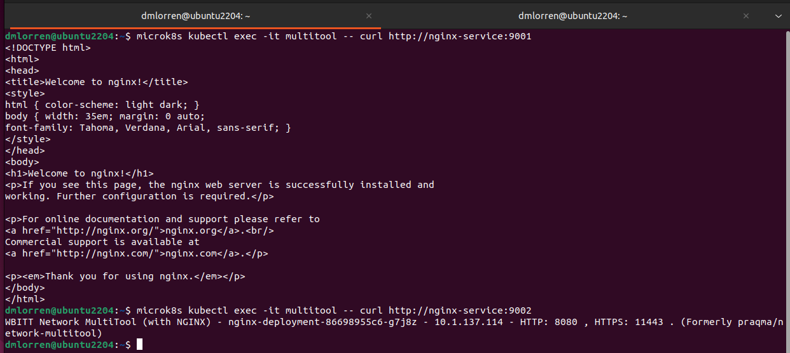
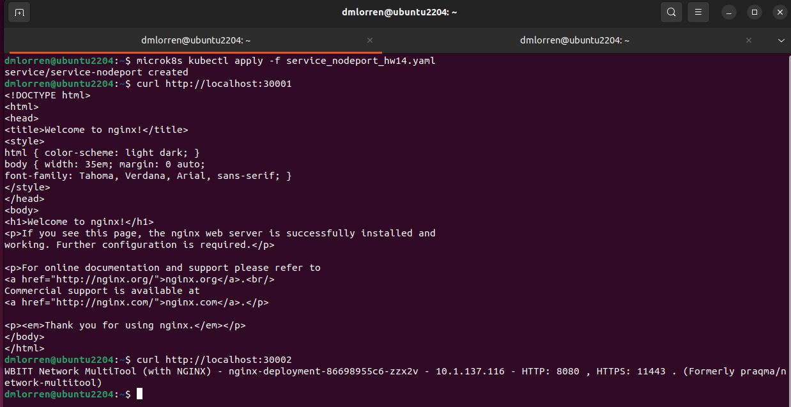
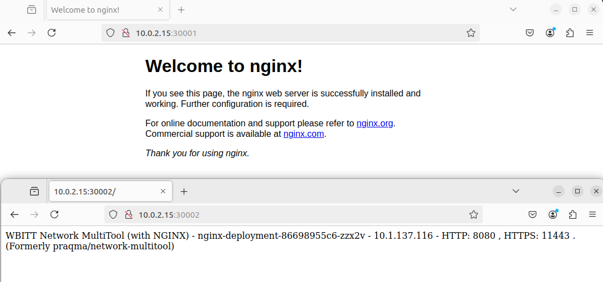

# Домашнее задание к занятию «Сетевое взаимодействие в K8S. Часть 1» - Иванов Дмитрий (fops-13)

### Цель задания

В тестовой среде Kubernetes необходимо обеспечить доступ к приложению, установленному в предыдущем ДЗ и состоящему из двух контейнеров, по разным портам в разные контейнеры как внутри кластера, так и снаружи.

------

### Чеклист готовности к домашнему заданию

1. Установленное k8s-решение (например, MicroK8S).
2. Установленный локальный kubectl.
3. Редактор YAML-файлов с подключённым Git-репозиторием.

------

### Инструменты и дополнительные материалы, которые пригодятся для выполнения задания

1. [Описание](https://kubernetes.io/docs/concepts/workloads/controllers/deployment/) Deployment и примеры манифестов.
2. [Описание](https://kubernetes.io/docs/concepts/services-networking/service/) Описание Service.
3. [Описание](https://github.com/wbitt/Network-MultiTool) Multitool.

------

### Задание 1. Создать Deployment и обеспечить доступ к контейнерам приложения по разным портам из другого Pod внутри кластера

1. Создать Deployment приложения, состоящего из двух контейнеров (nginx и multitool), с количеством реплик 3 шт.
2. Создать Service, который обеспечит доступ внутри кластера до контейнеров приложения из п.1 по порту 9001 — nginx 80, по 9002 — multitool 8080.
3. Создать отдельный Pod с приложением multitool и убедиться с помощью `curl`, что из пода есть доступ до приложения из п.1 по разным портам в разные контейнеры.
4. Продемонстрировать доступ с помощью `curl` по доменному имени сервиса.
5. Предоставить манифесты Deployment и Service в решении, а также скриншоты или вывод команды п.4.


### Ответ:

1. Согласно поставленному заданию подготовлены следующие манифесты:

- с объектом deployment:
[deployment_hw14.yaml](./src/deployment_hw14.yaml) 

- с объектом service:
[service_hw14.yaml](./src/service_hw14.yaml)

- с объектом pod для контейнера multitool
[multitool_hw14.yaml](./src/multitool_hw14.yaml)

2. Запускаем и проверяем:

```
microk8s kubectl apply -f deployment_hw14.yaml
microk8s kubectl apply -f service_hw14.yaml 
microk8s kubectl apply -f multitool_hw14.yaml 
microk8s kubectl get pods
microk8s kubectl get svc

microk8s kubectl exec -it multitool -- curl http://10.152.183.142:9001
microk8s kubectl exec -it multitool -- curl http://10.152.183.142:9002

microk8s kubectl exec -it multitool -- curl http://nginx-service:9001
microk8s kubectl exec -it multitool -- curl http://nginx-service:9002
```





------

### Задание 2. Создать Service и обеспечить доступ к приложениям снаружи кластера

1. Создать отдельный Service приложения из Задания 1 с возможностью доступа снаружи кластера к nginx, используя тип NodePort.
2. Продемонстрировать доступ с помощью браузера или `curl` с локального компьютера.
3. Предоставить манифест и Service в решении, а также скриншоты или вывод команды п.2.


### Ответ:

1. Согласно поставленному заданию подготовлен манифест:

- с объектом service:
[service_nodeport_hw14.yaml ](./src/service_nodeport_hw14.yaml )

```
microk8s kubectl apply -f service_nodeport_hw14.yaml 
curl http://localhost:30001
curl http://localhost:30002
```

2. Запускаем и проверяем:




```
dmlorren@ubuntu2204:~$ microk8s kubectl get svc

NAME               TYPE        CLUSTER-IP       EXTERNAL-IP   PORT(S)                         AGE

kubernetes         ClusterIP   10.152.183.1     <none>        443/TCP                         2d5h

nginx-service      ClusterIP   10.152.183.142   <none>        9001/TCP,9002/TCP               26m

service-nodeport   NodePort    10.152.183.124   <none>        9001:30001/TCP,9002:30002/TCP   3m28s
```


------
