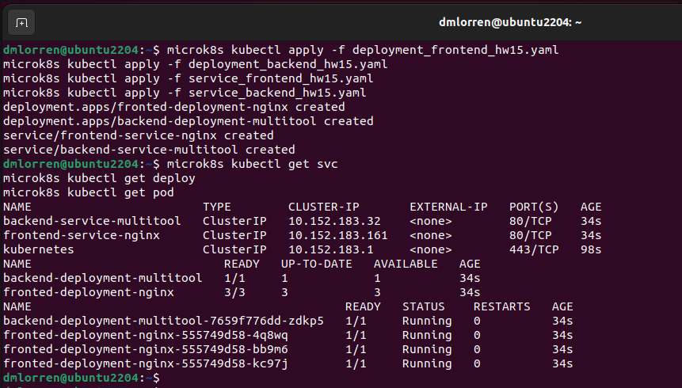
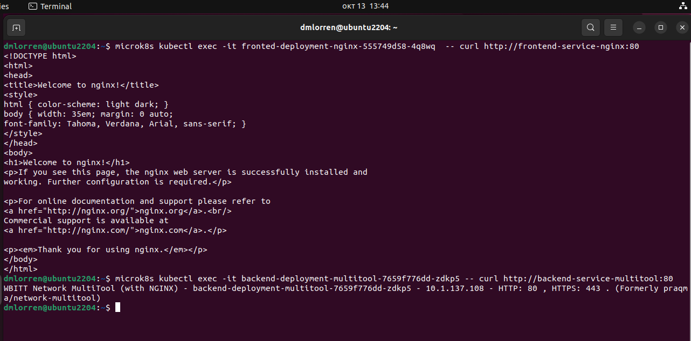
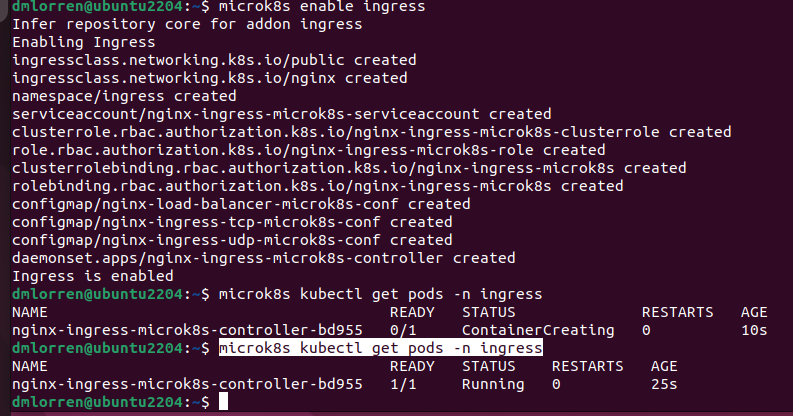
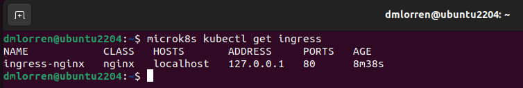
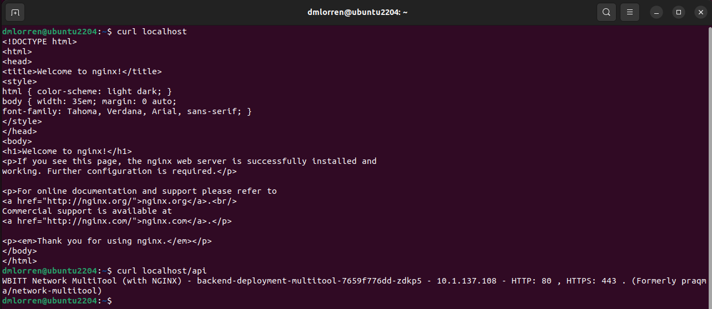

# Домашнее задание к занятию «Сетевое взаимодействие в K8S. Часть 2»

### Цель задания

В тестовой среде Kubernetes необходимо обеспечить доступ к двум приложениям снаружи кластера по разным путям.

------

### Чеклист готовности к домашнему заданию

1. Установленное k8s-решение (например, MicroK8S).
2. Установленный локальный kubectl.
3. Редактор YAML-файлов с подключённым Git-репозиторием.

------

### Инструменты и дополнительные материалы, которые пригодятся для выполнения задания

1. [Инструкция](https://microk8s.io/docs/getting-started) по установке MicroK8S.
2. [Описание](https://kubernetes.io/docs/concepts/services-networking/service/) Service.
3. [Описание](https://kubernetes.io/docs/concepts/services-networking/ingress/) Ingress.
4. [Описание](https://github.com/wbitt/Network-MultiTool) Multitool.

------

### Задание 1. Создать Deployment приложений backend и frontend

1. Создать Deployment приложения _frontend_ из образа nginx с количеством реплик 3 шт.
2. Создать Deployment приложения _backend_ из образа multitool. 
3. Добавить Service, которые обеспечат доступ к обоим приложениям внутри кластера. 
4. Продемонстрировать, что приложения видят друг друга с помощью Service.
5. Предоставить манифесты Deployment и Service в решении, а также скриншоты или вывод команды п.4.


### Ответ:

1. Сперва выполняем подготовительную часть, обновляем сертификаты и удалям ресурсы от прошлых ДЗ:
```
microk8s refresh-certs --cert ca.crt
microk8s kubectl delete all --all
```

2. Согласно поставленному заданию подготовлены следующие манифесты:

- с объектами deployment:
[deployment_frontend_hw15.yaml](./src/deployment_frontend_hw15.yaml) 
[deployment_backend_hw15.yaml](./src/deployment_backend_hw15.yaml) 


- с объектами service:
[service_frontend_hw15.yaml](./src/service_frontend_hw15.yaml)
[service_backend_hw15.yaml](./src/service_backend_hw15.yaml)

3. Выполняем установку:
```
microk8s kubectl apply -f deployment_frontend_hw15.yaml 
microk8s kubectl apply -f deployment_backend_hw15.yaml 
microk8s kubectl apply -f service_frontend_hw15.yaml 
microk8s kubectl apply -f service_backend_hw15.yaml 
microk8s kubectl get svc
microk8s kubectl get deploy
microk8s kubectl get pod
```




4. Проверяем, что приложения друг друга видят:
```
microk8s kubectl exec -it fronted-deployment-nginx-555749d58-4q8wq  -- curl http://frontend-service-nginx:80
microk8s kubectl exec -it backend-deployment-multitool-7659f776dd-zdkp5 -- curl http://backend-service-multitool:80
```




------

### Задание 2. Создать Ingress и обеспечить доступ к приложениям снаружи кластера

1. Включить Ingress-controller в MicroK8S.
2. Создать Ingress, обеспечивающий доступ снаружи по IP-адресу кластера MicroK8S так, чтобы при запросе только по адресу открывался _frontend_ а при добавлении /api - _backend_.
3. Продемонстрировать доступ с помощью браузера или `curl` с локального компьютера.
4. Предоставить манифесты и скриншоты или вывод команды п.2.


### Ответ:

1. Включаем Ingress-controller в MicroK8S и проверяем, что он работает:
```
microk8s enable ingress
microk8s kubectl get pods -n ingress
```



2. Подготавливаем Ingress, обеспечивающий доступ снаружи по IP-адресу кластера MicroK8S так:
- при запросе открытия "по адресу" открывается frontend; 
- при запросе с путём "/api" открывается backend;
- в качестве доменного имени используется localhost.

- подготовленный манифест ингресса:
[ingress-nginx_hw15.yaml](./src/ingress-nginx_hw15.yaml) 

```
microk8s kubectl apply -f ingress-nginx_hw15.yaml
microk8s kubectl get ingress
```



3. Демонстрируем доступ:
```
curl localhost
curl localhost/api
```
- как и ожидалось "по адресу" открывается frontend, а по "/api" открывается backend.


------

