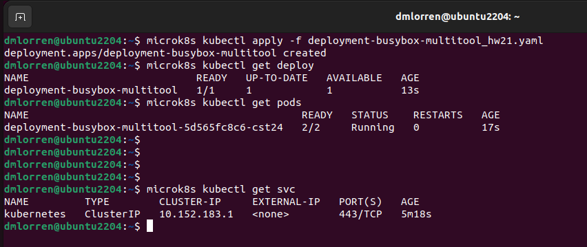
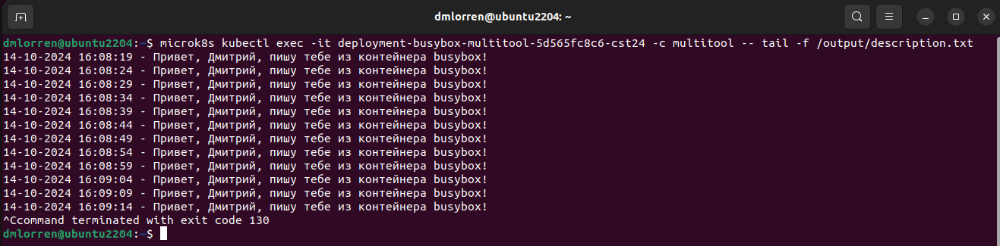
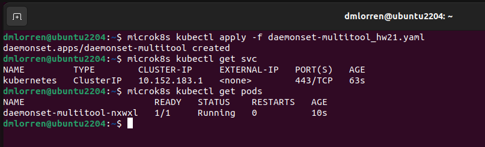
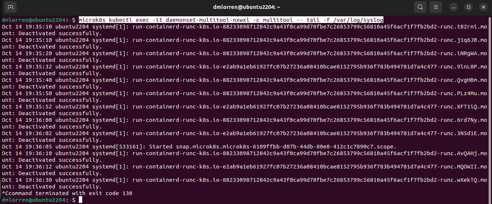

# Домашнее задание к занятию «Хранение в K8s. Часть 1» - Иванов Дмитрий (fops-13)

### Цель задания

В тестовой среде Kubernetes нужно обеспечить обмен файлами между контейнерам пода и доступ к логам ноды.

------

### Чеклист готовности к домашнему заданию

1. Установленное K8s-решение (например, MicroK8S).
2. Установленный локальный kubectl.
3. Редактор YAML-файлов с подключенным GitHub-репозиторием.

------

### Дополнительные материалы для выполнения задания

1. [Инструкция по установке MicroK8S](https://microk8s.io/docs/getting-started).
2. [Описание Volumes](https://kubernetes.io/docs/concepts/storage/volumes/).
3. [Описание Multitool](https://github.com/wbitt/Network-MultiTool).

------

### Задание 1 

**Что нужно сделать**

Создать Deployment приложения, состоящего из двух контейнеров и обменивающихся данными.

1. Создать Deployment приложения, состоящего из контейнеров busybox и multitool.
2. Сделать так, чтобы busybox писал каждые пять секунд в некий файл в общей директории.
3. Обеспечить возможность чтения файла контейнером multitool.
4. Продемонстрировать, что multitool может читать файл, который периодически обновляется.
5. Предоставить манифесты Deployment в решении, а также скриншоты или вывод команды из п. 4.


### Ответ:

1. Сперва выполняем подготовительную часть, обновляем сертификаты и удалям ресурсы от прошлых ДЗ:
```
microk8s refresh-certs --cert ca.crt
microk8s kubectl delete all --all
```

2. Подготавливаем манифест согласно требованиям:
[deployment-busybox-multitool_hw21.yaml](./src/deployment-busybox-multitool_hw21.yaml) 


2. Выполняем запуск пода, заходим в контейнер multitool и выполняем там команду tail и читаем выхлоп с busybox, тем самым убеждаемся, что задание выполнено.
```
microk8s kubectl apply -f deployment-busybox-multitool_hw21.yaml 
microk8s kubectl get deploy
microk8s kubectl get pods
microk8s kubectl exec -it deployment-busybox-multitool-5d565fc8c6-cst24 -c multitool -- tail -f /output/description.txt
```




------

### Задание 2

**Что нужно сделать**

Создать DaemonSet приложения, которое может прочитать логи ноды.

1. Создать DaemonSet приложения, состоящего из multitool.
2. Обеспечить возможность чтения файла `/var/log/syslog` кластера MicroK8S.
3. Продемонстрировать возможность чтения файла изнутри пода.
4. Предоставить манифесты Deployment, а также скриншоты или вывод команды из п. 2.


### Ответ:

1. Чистим ресурсы от прошлого упражнения:
```
microk8s kubectl delete all --all
```

2. Подготавливаем манифест согласно требованиям:
[daemonset-multitool_hw21.yaml](./src/daemonset-multitool_hw21.yaml) 

Примечание:
- Аналогично упражнению №1, логи читаем через "tail -f"
- Тип volume выбран не emptyDir, как в первом задании, а hostPath, так как в данном случае необходимо предоставить доступ к локальной файловой системе ноды.

3. Выполняем запуск пода, заходим в контейнер multitool и выполняем там команду tail на чтение syslog, тем самым убеждаемся, что задание выполнено.
```
microk8s kubectl apply -f daemonset-multitool_hw21.yaml
microk8s kubectl get pods
microk8s kubectl get svc
microk8s kubectl exec -it daemonset-multitool-nxwxl -c multitool -- tail -f /var/log/syslog
```




------


