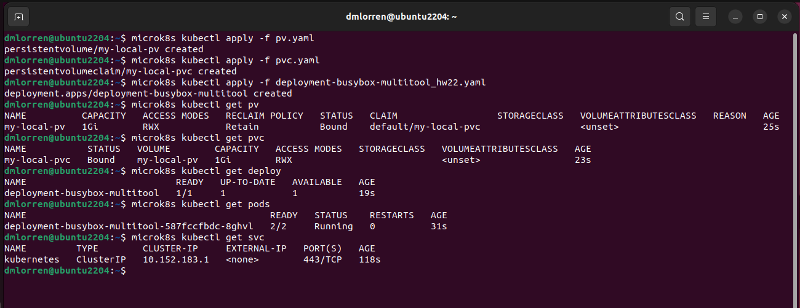
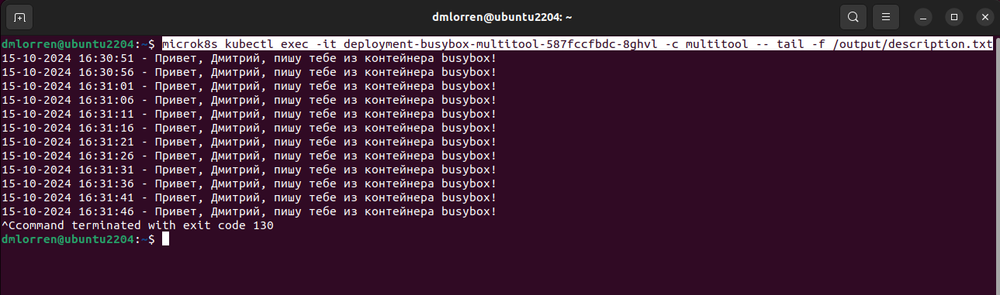
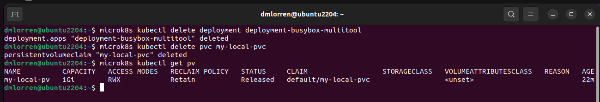
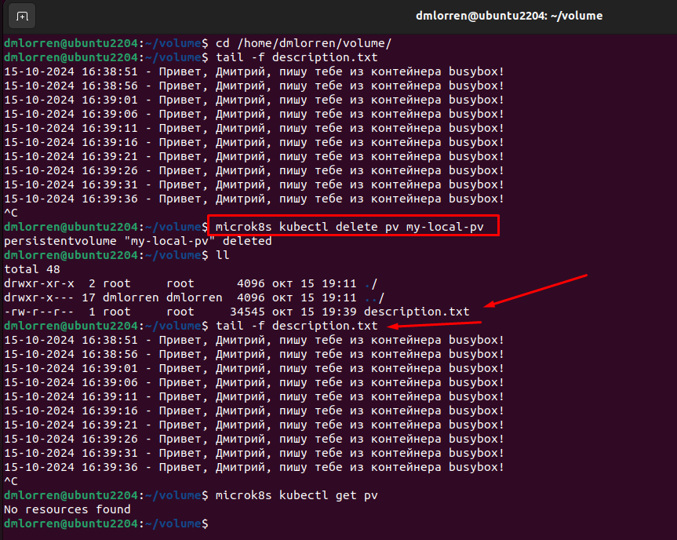
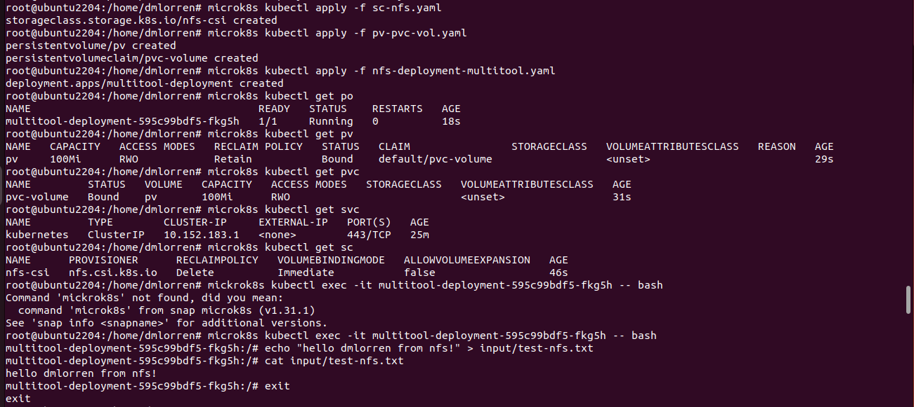
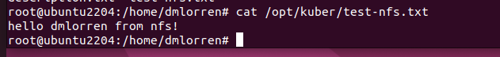

# Домашнее задание к занятию «Хранение в K8s. Часть 2» - Иванов Дмитрий (fops-13)

### Цель задания

В тестовой среде Kubernetes нужно создать PV и продемострировать запись и хранение файлов.

------

### Чеклист готовности к домашнему заданию

1. Установленное K8s-решение (например, MicroK8S).
2. Установленный локальный kubectl.
3. Редактор YAML-файлов с подключенным GitHub-репозиторием.

------

### Дополнительные материалы для выполнения задания

1. [Инструкция по установке NFS в MicroK8S](https://microk8s.io/docs/nfs). 
2. [Описание Persistent Volumes](https://kubernetes.io/docs/concepts/storage/persistent-volumes/). 
3. [Описание динамического провижининга](https://kubernetes.io/docs/concepts/storage/dynamic-provisioning/). 
4. [Описание Multitool](https://github.com/wbitt/Network-MultiTool).

------

### Задание 1

**Что нужно сделать**

Создать Deployment приложения, использующего локальный PV, созданный вручную.

1. Создать Deployment приложения, состоящего из контейнеров busybox и multitool.
2. Создать PV и PVC для подключения папки на локальной ноде, которая будет использована в поде.
3. Продемонстрировать, что multitool может читать файл, в который busybox пишет каждые пять секунд в общей директории. 
4. Удалить Deployment и PVC. Продемонстрировать, что после этого произошло с PV. Пояснить, почему.
5. Продемонстрировать, что файл сохранился на локальном диске ноды. Удалить PV.  Продемонстрировать что произошло с файлом после удаления PV. Пояснить, почему.
6. Предоставить манифесты, а также скриншоты или вывод необходимых команд.


### Ответ:

1. Сперва выполняем подготовительную часть, обновляем сертификаты и удалям ресурсы от прошлых ДЗ:
```
microk8s refresh-certs --cert ca.crt
microk8s kubectl delete all --all
```

2. Подготавливаем манифесты согласно требованиям:
[deployment-busybox-multitool_hw22.yaml](./src/deployment-busybox-multitool_hw22.yaml) 
[pv.yaml](./src/pv.yaml) 
[pvc.yaml](./src/pvc.yaml) 

3. Выполняем запуск постоянного тома PV, PVC-запроса и нашего пода, заходим в контейнер multitool и выполняем там команду tail, тем самым убеждаемся, что задание выполнено.
```
microk8s kubectl apply -f pv.yaml
microk8s kubectl apply -f pvc.yaml
microk8s kubectl apply -f deployment-busybox-multitool_hw22.yaml
microk8s kubectl get pvc
microk8s kubectl get pv
microk8s kubectl get deploy
microk8s kubectl get pods
microk8s kubectl get srv

microk8s kubectl exec -it deployment-busybox-multitool-587fccfbdc-8ghvl -c multitool -- tail -f /output/description.txt
```





4. Далее удаляем Deployment и запрос на том PVC. Проверяем, что после этого произошло с PV. Пробуем объяснить почему.
```
microk8s kubectl delete deployment deployment-busybox-multitool
microk8s kubectl delete pvc my-local-pvc
```



Пояснение:
```
Наш постоянный том - PV поменял статус с Bound (связывание) на статус Released (освобожден) это означает, что данный PV готов к новому связыванию объектов по причине того, что ранее PVC и Deployment, которые были в цепочке связывания, более в этой цепочки не участвуют. Следовательно, данный PV готов к тому, чтобы к нему подключился новый PVC-запрос с Deployment.
```


5. Теперь удаляем наш постоянный том PV и проверяем что произойдёт с файлом.
```
microk8s kubectl delete pv my-local-pv
```


Пояснение:
```
При конфигурировании постоянного тома PV использовался режим ReclaimPolicy: Retain, при котором Retain означает, что после удаления PV ресурсы из внешних провайдеров автоматически не удаляются. Даже после удаления PV тома руками файлы также остаются.
```

------

### Задание 2

**Что нужно сделать**

Создать Deployment приложения, которое может хранить файлы на NFS с динамическим созданием PV.

1. Включить и настроить NFS-сервер на MicroK8S.
2. Создать Deployment приложения состоящего из multitool, и подключить к нему PV, созданный автоматически на сервере NFS.
3. Продемонстрировать возможность чтения и записи файла изнутри пода. 
4. Предоставить манифесты, а также скриншоты или вывод необходимых команд.


### Ответ:

1. Проводим установку согласно документации https://microk8s.io/docs/how-to-nfs
2. На её основе так же готовим наши манифесты:

[sc-nfs.yaml](./src/sc-nfs.yaml) 
[pv-pvc-vol.yaml](./src/pv-pvc-vol.yaml) 
[nfs-deployment-multitool.yaml](./src/nfs-deployment-multitool.yaml) 


3. Выполняем блок команд:
```
microk8s kubectl apply -f sc-nfs.yaml 
microk8s kubectl apply -f pv-pvc-vol.yaml 
microk8s kubectl apply -f nfs-deployment-multitool.yaml


microk8s kubectl get po
microk8s kubectl get pvc
microk8s kubectl get sc
microk8s kubectl get deploy
microk8s kubectl get pv

microk8s kubectl exec -it multitool-deployment-595c99bdf5-fkg5h -- bash

в контейнере:
multitool-deployment-595c99bdf5-fkg5h:/# echo "hello dmlorren from nfs!" > input/test-nfs.txt
cat input/test-nfs.txt 
```


4. И окончательно убеждаемся, что на хосте файл прокинулся из контейнера:



------
