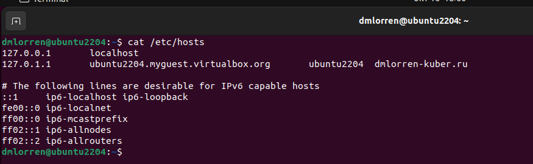

# Домашнее задание к занятию «Конфигурация приложений» Иванов Дмитрий (fops-13)

### Цель задания

В тестовой среде Kubernetes необходимо создать конфигурацию и продемонстрировать работу приложения.

------

### Чеклист готовности к домашнему заданию

1. Установленное K8s-решение (например, MicroK8s).
2. Установленный локальный kubectl.
3. Редактор YAML-файлов с подключённым GitHub-репозиторием.

------

### Инструменты и дополнительные материалы, которые пригодятся для выполнения задания

1. [Описание](https://kubernetes.io/docs/concepts/configuration/secret/) Secret.
2. [Описание](https://kubernetes.io/docs/concepts/configuration/configmap/) ConfigMap.
3. [Описание](https://github.com/wbitt/Network-MultiTool) Multitool.

------

### Задание 1. Создать Deployment приложения и решить возникшую проблему с помощью ConfigMap. Добавить веб-страницу

1. Создать Deployment приложения, состоящего из контейнеров nginx и multitool.
2. Решить возникшую проблему с помощью ConfigMap.
3. Продемонстрировать, что pod стартовал и оба конейнера работают.
4. Сделать простую веб-страницу и подключить её к Nginx с помощью ConfigMap. Подключить Service и показать вывод curl или в браузере.
5. Предоставить манифесты, а также скриншоты или вывод необходимых команд.


### Ответ:
Начнём с подготовки манифестов, сразу следует отметить, что два наших контейнера работающих на одном 80-ом порту вместе не запустятся.
Учитывая этот нюанс и исходя из поставленого задания вносим следующие правки в наш deployment (переделываем от прошлых ДЗ):
1. решаем проблему портов с помощью переопределения порта для multitool через переменные окружения (env) и ConfigMap на порт 8080;
2. готовим для нашего контейнера с nginx объект ConfigMap, а в качестве содержимого страницы будет выводиться "hello dmitriy!";
3. далее объект ConfigMap для nginx монтируем в качестве volume к контейнеру;
4. и готовим дополнительный объект service для доступа извне (используется type: NodePort на порту 30081).

- итого подготовленные манифесты:
[deployment_hw23.yaml](./src/deployment_hw23.yaml) 
[nginxservice_hw23.yaml ](./src/nginxservice_hw23.yaml) 
[configmap_hw23.yaml ](./src/configmap_hw23.yaml ) 

- выполняем блок команд и убеждаемся в правильности выполнения поставленного задания:
```
microk8s refresh-certs --cert ca.crt
microk8s kubectl delete all --all

microk8s kubectl apply -f deployment_hw23.yaml
microk8s kubectl apply -f nginxservice_hw23.yaml 
microk8s kubectl apply -f configmap_hw23.yaml 

microk8s kubectl get pods
microk8s kubectl get deploy
microk8s kubectl get svc
microk8s kubectl get cm
```


------

### Задание 2. Создать приложение с вашей веб-страницей, доступной по HTTPS 

1. Создать Deployment приложения, состоящего из Nginx.
2. Создать собственную веб-страницу и подключить её как ConfigMap к приложению.
3. Выпустить самоподписной сертификат SSL. Создать Secret для использования сертификата.
4. Создать Ingress и необходимый Service, подключить к нему SSL в вид. Продемонстировать доступ к приложению по HTTPS. 
4. Предоставить манифесты, а также скриншоты или вывод необходимых команд.


### Ответ:


1. Выпускаем самоподписной сертификат SSL: 
```
openssl req -x509 -nodes -days 365 -newkey rsa:2048 -keyout nginx.key -out nginx.crt
```


2. Создаём Secret для использования сертификата:
```
microk8s kubectl create secret tls nginx-tls --cert=nginx.crt --key=nginx.key
```


3. Готовим наше доменное имя в /etc/hosts


4. Готовим манифесты:
[deployment-nginx_part2.yaml](./src/deployment-nginx_part2.yaml)
[ingress_hw23.yaml](./src/ingress_hw23.yaml)
[nginxservice_part2.yaml](./src/nginxservice_part2.yaml)
[configmap_hw23_part2.yaml](./src/configmap_hw23_part2.yaml)

5. Проверяем:


------
