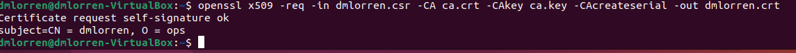
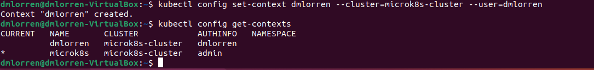
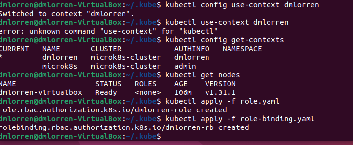
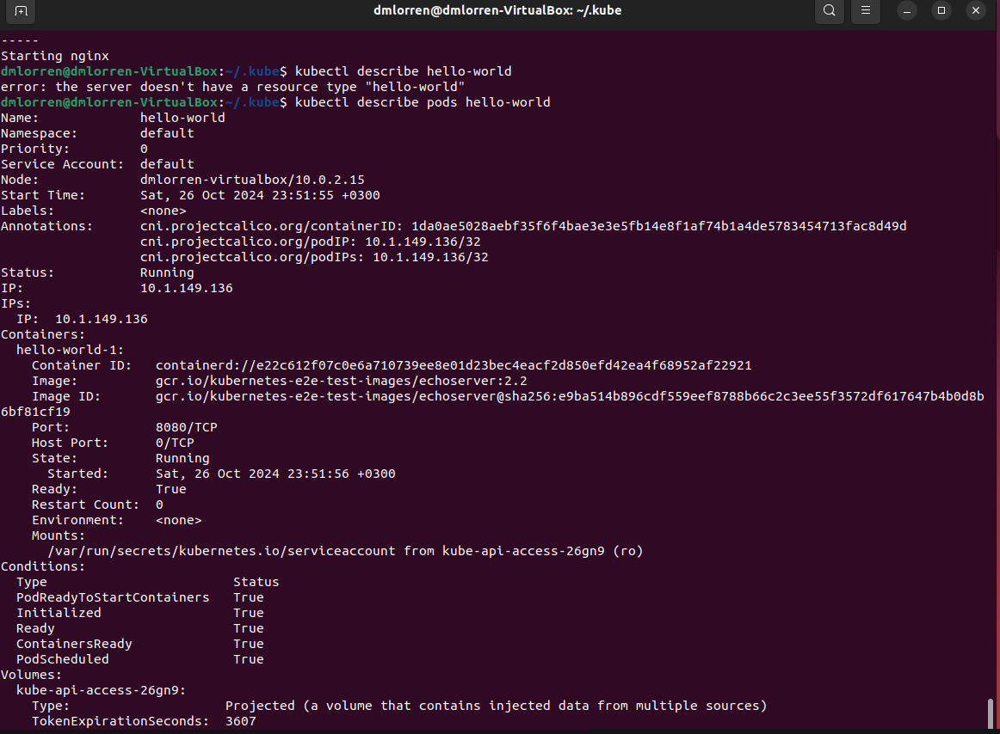
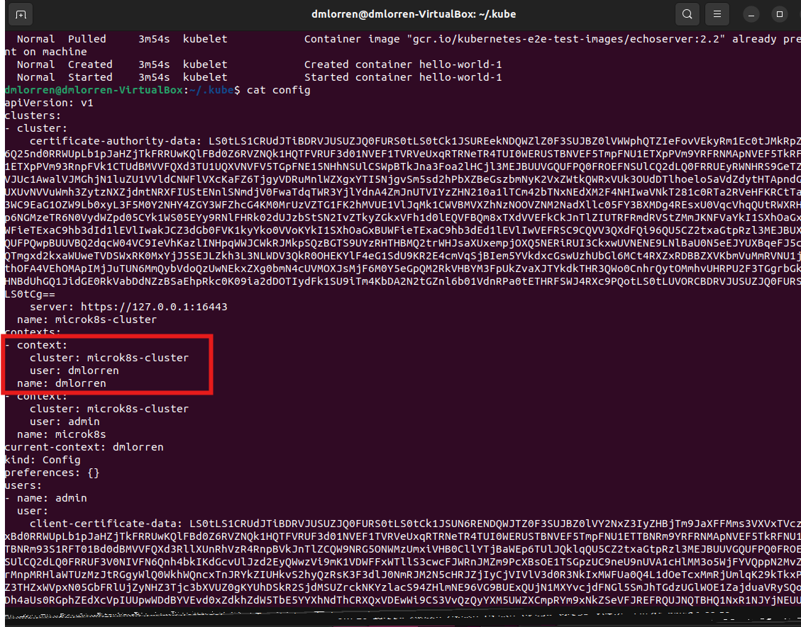
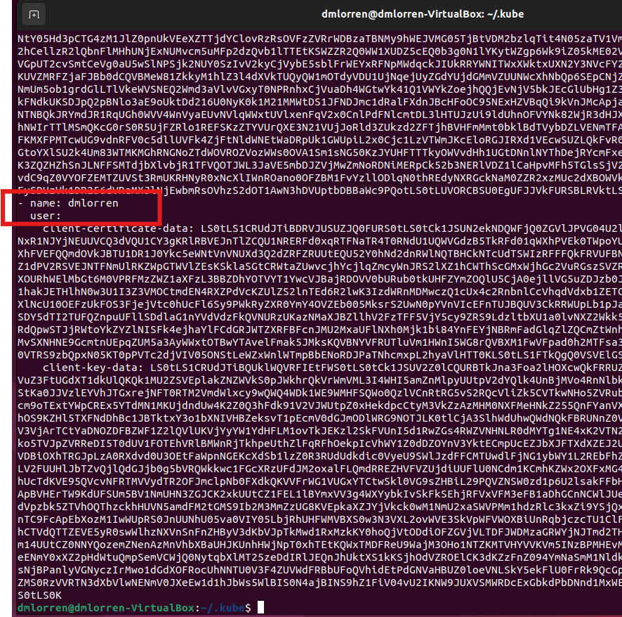

# Домашнее задание к занятию «Управление доступом» - Иванов Дмитрий (fops-13)

### Цель задания

В тестовой среде Kubernetes нужно предоставить ограниченный доступ пользователю.

------

### Чеклист готовности к домашнему заданию

1. Установлено k8s-решение, например MicroK8S.
2. Установленный локальный kubectl.
3. Редактор YAML-файлов с подключённым github-репозиторием.

------

### Инструменты / дополнительные материалы, которые пригодятся для выполнения задания

1. [Описание](https://kubernetes.io/docs/reference/access-authn-authz/rbac/) RBAC.
2. [Пользователи и авторизация RBAC в Kubernetes](https://habr.com/ru/company/flant/blog/470503/).
3. [RBAC with Kubernetes in Minikube](https://medium.com/@HoussemDellai/rbac-with-kubernetes-in-minikube-4deed658ea7b).

------

### Задание 1. Создайте конфигурацию для подключения пользователя

1. Создайте и подпишите SSL-сертификат для подключения к кластеру.
2. Настройте конфигурационный файл kubectl для подключения.
3. Создайте роли и все необходимые настройки для пользователя.
4. Предусмотрите права пользователя. Пользователь может просматривать логи подов и их конфигурацию (`kubectl logs pod <pod_id>`, `kubectl describe pod <pod_id>`).
5. Предоставьте манифесты и скриншоты и/или вывод необходимых команд.


Ответ:

1. Делаем копию кубовского сертификата и ключа:
```
cp /var/snap/microk8s/current/certs/ca.crt /home/dmlorren/
cp /var/snap/microk8s/current/certs/ca.key /home/dmlorren/
```

2. Включаем плагин rbac:
```
microk8s enable rbac

icrok8s enable rbac
Infer repository core for addon rbac
Enabling RBAC
Reconfiguring apiserver
[sudo] password for dmlorren: 
Restarting apiserver
RBAC is enabled
```

3. Создаём ключ для ключ пользователя и запрос на подпись:
```
openssl genrsa -out dmlorren.key 2048
openssl req -new -key dmlorren.key -out dmlorren.csr -subj "/CN=dmlorren/O=ops"
```

4. Подписываем клиентский сертификат с использованием dmlorren.csr
```
openssl x509 -req -in dmlorren.csr -CA ca.crt -CAkey ca.key -CAcreateserial -out dmlorren.crt
```



5. Готовим конфигурационный файл kubectl под нашего пользователя. 
```
kubectl config set-credentials dmlorren --client-certificate=dmlorren.crt --client-key=dmlorren.key --embed-certs=true
kubectl config set-context dmlorren --cluster=microk8s-cluster --user=dmlorren
kubectl config get-contexts
```


6. И от нашего же пользователя проводим деплой:
```
kubectl apply -f pods.yaml (для примера взял из первого задания)
kubectl apply -f role.yaml
kubectl apply -f role-binding.yaml
```

Результат:

[role.yaml](./src/role.yaml)
[role-binding.yaml](./src/role-binding.yaml)







------
